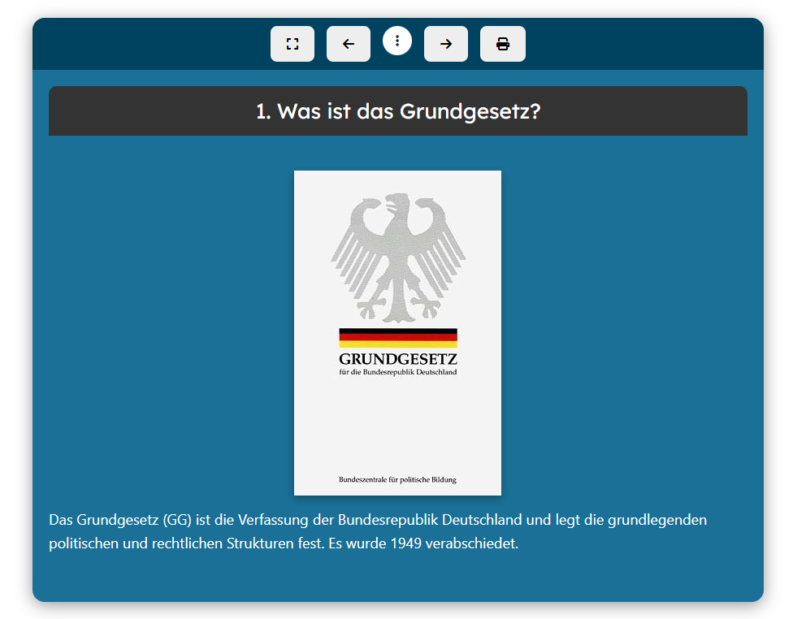
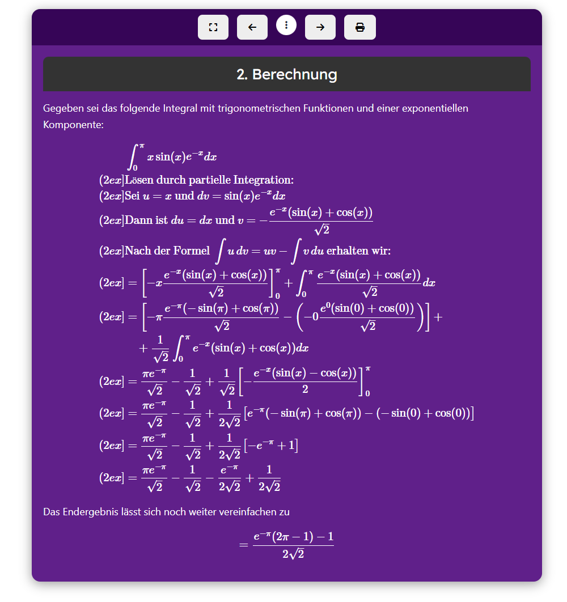

# Presentation

Presentation is a preset for the Moodle activity database.

## Description

Students create a short, slide-based presentation. They can focus on the content as the formatting is taken from the template. The students only need to define an H3 heading as a slide separator.

## Getting started

Download the [ZIP file from releases](https://github.com/fdagner/presentation_moodle-database-preset/releases). Create a "Database" activity in Moodle and then upload the ZIP file.

## Features
- Color accent selectable
- Font color is set depending on the color accent
- Automatic slides with automatic numbering
- Supports filters, e.g. latex
- Full screen mode
- Print and PDF export

## Language Support

The preset is available in German, but there is not so much to translate. The template can easily be adapted.

## Screenshots

